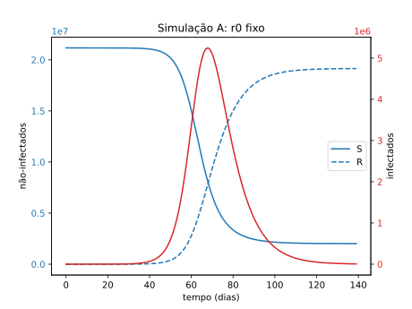
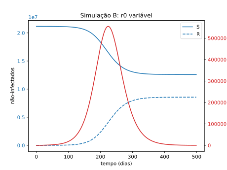

# Calculo-Numerico-SIR
Uso do modelo SIR para modelagem da epidemia do COVID-19 no Brasil.

## Membros do Grupo
Guido Neulaender

Heloisa Pimentel

Silas Leonel

Rodrigo Ryan

João Francisco

## Alguns dados preliminares
### Brasil

### São Paulo

### Minas Gerais

## Simulações para Minas Gerais (MG)
### r0 = 2.6 fixo

### r0 como função do tempo

